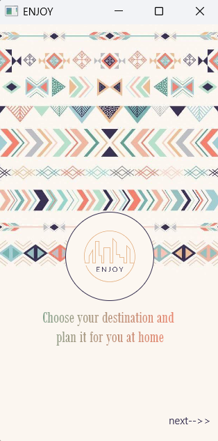
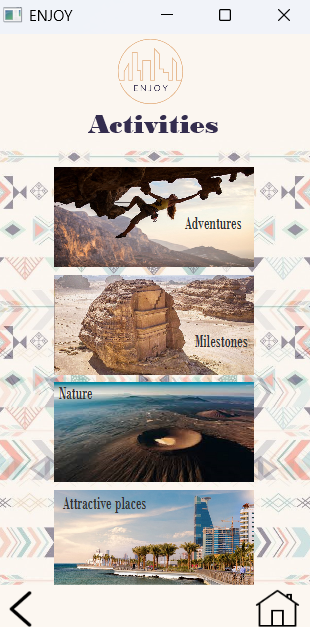
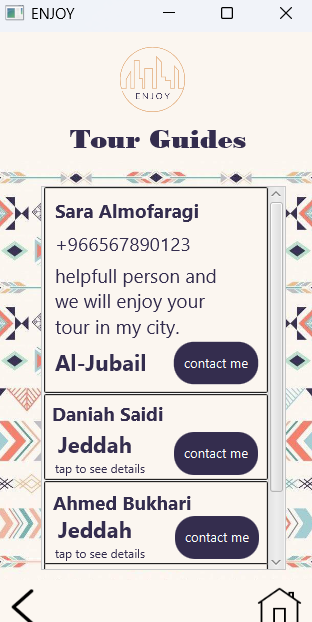

# ✨ EnjoySaudiApp

**EnjoySaudiApp** is a prototype desktop-based tourism app created using Java.  
It features simple navigation between Saudi cities, tourism activities, and local tour guides.

---

## 🌄 Preview

### 🧭 Welcome Screen  
The opening screen with a traditional touch and brand identity.

---

### 🌟 Activities Section  
Explore exciting adventures, nature spots, and tourist attractions.

---

### 👥 Tour Guides  
Browse available local tour guides with their contact info and cities.

---

## 🛠️ Tech Stack

- Java (Swing UI)
- NetBeans IDE
- Object-Oriented Programming
- FXML for structured UI
- Manual screen linking (no database)

---

## 🚀 Features

- Multi-screen navigation (Jeddah, Riyadh, Tabuk...)
- Contact info for guides
- Basic trip planning categories:
  - Weekend
  - Weekly
  - Monthly
- Designed to simulate a tourism experience in Saudi Arabia

---

## 📁 Structure

src/
├── controllers/
├── views/
├── ENJOY.java
└── resources/images/

---

## 📫 Author

Developed by **Maram Metro**  
GitHub: [Maram-Metro](https://github.com/Maram-Metro)

---

## 📝 Note

This project is a UI prototype created for learning and concept demonstration purposes.  
It does not include a live database or external API — it is focused on layout and screen flow only.
